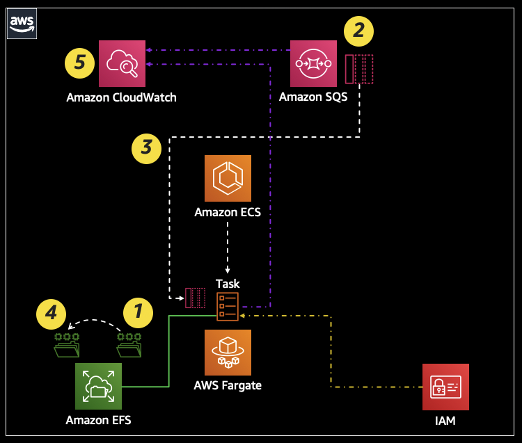
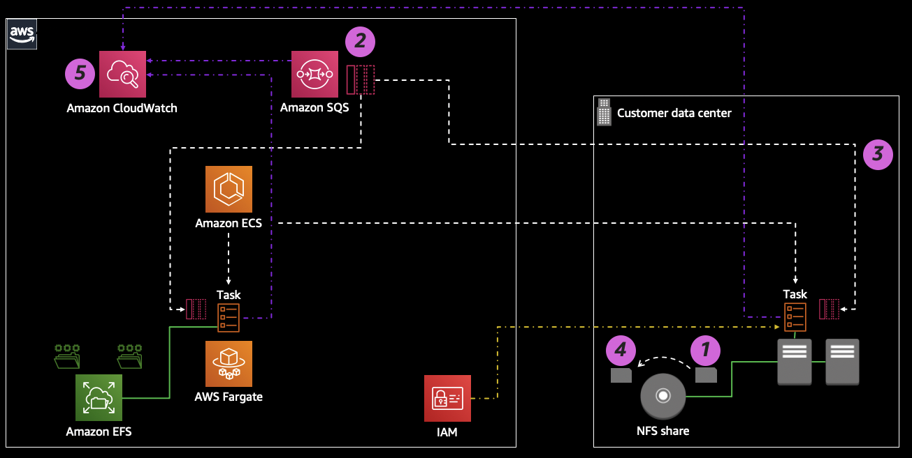
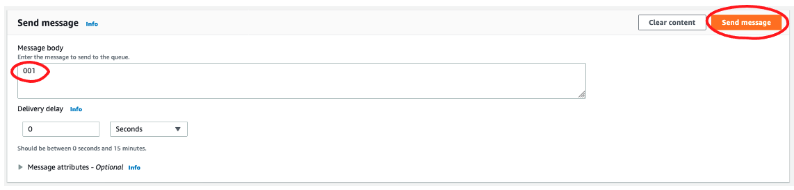
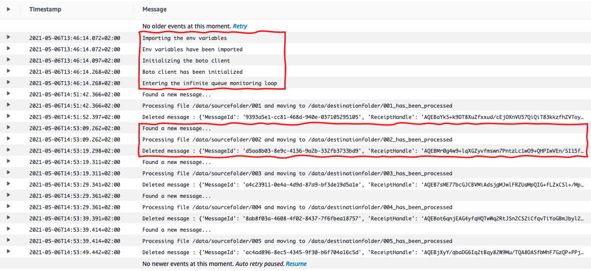
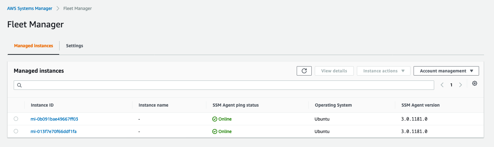
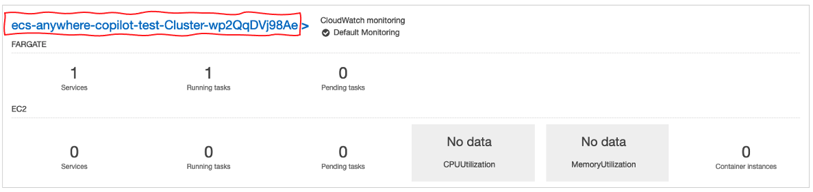
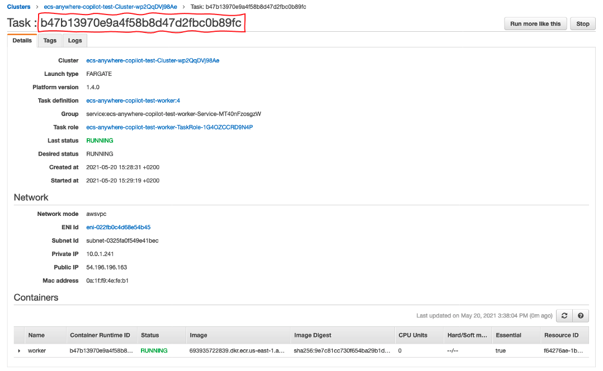

### Introduction

This tutorial is intended to walk you through an opinionated demonstration of how [ECS Anywhere](https://aws.amazon.com/ecs/anywhere) works. The initial steps will show you how to deploy a (somewhat) sophisticated multi services application in an AWS region as an ECS service running on [AWS Fargate](https://aws.amazon.com/fargate/). Further in the tutorial, the steps will guide you through how to deploy parts of this application on ECS Anywhere managed instances in a customer managed infrastructure outside of the AWS region. This tutorial is based on the code and workflow that has been used for the [re:Invent 2020 announcement of ECS Anywhere](https://aws.amazon.com/blogs/containers/introducing-amazon-ecs-anywhere/).

---
**NOTE**

This tutorial requires a bit of more work than what you'd need to do to deploy a standalone `nginx` container on ECS Anywhere for a quick test purpose. This tutorial tries to mimic a real life scenario with its own story; as a result the workflows are slightly longer. It is likely that you will learn more than just ECS Anywhere going through this but it will require a bit more time to unpack.  

---


### The application architecture

The application is written in Python. The logic of the code implements a worker that continuously checks for new messages in an Amazon SQS queue. If the queue contains new messages, the body of these messages are checked against the name of the files hosted in a source folder on Amazon EFS. If there is a match between the body of the message and the file name, the file is renamed and moved to a destination folder (also on Amazon EFS). The application logs all its activity to Amazon CloudWatch and Fargate pulls the application image from Amazon ECR. This setup makes heavy usage of AWS native integrations such as IAM roles assigned to the ECS task for the application to transparently read from the SQS queue, pull from ECR, access the EFS share and log to CloudWatch. This is a high level diagram of the application and the flow it supports:

 


### The challenge

Assume this is an application that has been developed for a global deployment. However, some of the contries where this application needs to be available have stringent requirements in terms of data residency. In particular the files that are being processed by the application contains `personal identifiable information` (PII) that needs to remain within specific country's border. Unfortunately, in these countries AWS doesn't have a regional presence. In addition, some of these countries have additional compliance requirements that requires data to be hosted on IT systems that are fully controlled by local customer teams. The team that built this application is hesitant to embark into investigating brand new tools to facilitate hybrid deployments and, in addition, they are very happy with the fully managed nature of the architecture they are using.  


### The solution 

The application team can leverage ECS Anywhere to continue maintaining all the architectural benefits and hand-off to AWS as many operations as possible. ECS Anywhere allows the team to literally decompose the architecture and stretch the deployment in a way that makes the setup fully compliant with the requirements of these countries and making their stretched deployment a viable and acceptable operational exception. This requires maintaining the data on the customer-managed infrastructure and moving the Python application running on the same infrastructure. ECS Anywhere allows the task to participate in the native AWS integrations. In particular it will retain the possibility (via IAM task roles and IAM execution task roles) to read from the SQS queue, pull from ECR and log to CloudWatch without the team having to deal with distributing credentials outside of the region. In addition, ECS Anywhere and its regional control plane architecture will mitigate greatly operational concerns. This is a high level diagram of the stretched application deployment mechanism that they can treat as an exception on a need basis: 

 


### Prerequisites  

To get started with the deployment you need an [AWS account](https://aws.amazon.com/premiumsupport/knowledge-center/create-and-activate-aws-account/) and the [latest CLI installed](https://docs.aws.amazon.com/cli/latest/userguide/cli-chap-install.html) and [configured](https://docs.aws.amazon.com/cli/latest/userguide/cli-chap-configure.html). Make sure that the region is configured properly. 

Also be sure that your shells throughout the tutorial have the following variables available. We will use them extensively. 
```
export ACCOUNTNUMBER=<your account>
export MYREGION=<your region>
```

Before you start, clone this repository locally and move into it:
```
git clone https://github.com/aws-containers/ecs-anywhere-tutorial
cd ecs-anywhere-tutorial
``` 

Depending on the path you will take in this tutorial, there may be additional pre-requisites that will be called out. 


### The regional deployment  

First of all, we will deploy the application in the aws region of your choice. During the [re:Invent demo](https://aws.amazon.com/blogs/containers/introducing-amazon-ecs-anywhere/) we have shown how to setup the regional deployment using [the new Docker Compose CLI that can deploy to Amazon ECS](https://docs.docker.com/cloud/ecs-integration/). For this tutorial you have two options: 

- using [AWS Copilot](./app/copilot/README.md) 
- using the [Docker Compose integration with ECS](./app/docker-compose/README.md) 

Please pick one and complete the steps. Deploying in the region is a mandatory step for this tutorial. Once you have deployed the application in the region, we can start testing that it works correctly. 


### Testing the regional deployment  

If you have a working in-region deployment, we will inspect the two folders the application has created on the EFS file system mounted under `/data`. In particular we will make sure they are empty and we will create 5 files (named `001`, `002`, `003`, `004` and `005`) in the `sourcefolder`:
```
# ls /data/sourcefolder     
# ls /data/destinationfolder
# cd /data/sourcefolder/ && touch 001 002 003 004 005 && cd /
# ls /data/sourcefolder    
001  002  003  004  005
# ls /data/destinationfolder
# 
```

---
**NOTE**

The example above assumes you have exec'ed into the worker container and you are manipulating the `/data` folder mount directly. If you are mounting the EFS files system from another environment your paths may be different.  

---

If you navigate in your SQS console and open the `main-queue` we have created, you can click on `Send and receive messages` and from there you can send 5 separate and distinct messages with a body that matches the 5 file names above. This is my first message: 

 


Once you have completed sending the 4 messages, after a few seconds, if you look at the folders above, you should see that the files have been processed (renamed and moved): 
```
# ls /data/sourcefolder
# ls /data/destinationfolder
001_has_been_processed	002_has_been_processed	003_has_been_processed	004_has_been_processed	005_has_been_processed
# 
```
If you look at the logs in the CloudWatch log group you will see all the details. The first part of the log is the application initializing while the remaining log entries are the files being processed. You can check the CW log group the application is using in the worker container in the ECS task. 

 

Congratulations! You have a working deployment in the AWS region of your choice! 


### Selecting the infrastructure for the stretched deployment 

Now that we have a working regional deployment we will work to separate what will remain in the region (the SQS queue, the ECR repository, the CloudWatch log group) from what will be re-deployed outside of the region. The first thing we need to do is to identify where we want to run our tasks outside of the region. For the [demo at re:Invent](https://aws.amazon.com/blogs/containers/introducing-amazon-ecs-anywhere/) we have used two Raspberry Pi's. This could absolutely be done again (with some additional considerations due to different CPU architectures). It is possible (and likely) that you may want to use some bare metal or virtual machines in your data center. That is also fine (and expected). 

In reality you can use any infrastructure provided it meets these characteristics: 
- the operating systems have outbound Internet connectivity (they need to reach AWS cloud services endpoints)
- the operating systems are included in the list of [operating systems supported by ECS Anywhere](https://docs.aws.amazon.com/AmazonECS/latest/developerguide/ecs-anywhere.html)
- the systems have at least 1 vCPU and 512MB of memory to run the SSM agent, the ECS agent and the Python application in this tutorial  
- for this tutorial specifically, all instances need to map a shared folder under the `/data` mountpoint to mimic the in-region mount of the EFS file system  

In this tutorial we have included the following alternative(s): 
- [Vagrant with Virtualbox](./instances-preparation/vagrant/README.md)

Again, this was just a convenient way for this demo to provision non EC2 capacity. Feel free to use any other type of infrastructure (e.g. VMware vSphere) that can run any of the [operating systems supported by ECS Anywhere](https://docs.aws.amazon.com/AmazonECS/latest/developerguide/ecs-anywhere.html).


### Preparing for the stretched deployment 

Before we can start to deploy the ECS task on the infrastructure you have created outside of AWS, we need to prepare that infrastructure. This consists of two things: 

- preparing the AWS resources 
- preparing the infrastructure nodes   

#### Preparing AWS resources  

In this step we will create a separate ECS cluster that will host the remote nodes, we will create the `instance role` that we will use to register the SSM agent and we will generate the SSM keys to register these nodes in AWS Systems Manager.

Move into the `/anywhere-preparation` folder in the repo. Then run the `pre-instance-preparation-setup-external.sh` script and follow the instructions. Feel free to inspect the script to investigate what it does. Note that the script informs you about the names it is using by default to create the resources above. You should accept them unless you have a burning need/desire to change them in the script (note if you do so you will later need to change the other scripts). 

#### Preparing the infrastructure nodes 

The script above, at the end of the execution, will suggest a number of exports (the SSM Keys, the ECS cluster to connect to and the region you set with the `MYREGION` variable). Please gain a shell in each of the nodes in the infrastructure you provisioned (through Vagrant or anything you opted to use) and execute those exports. Once you have executed them, run these commands to download and execute the ECS Anywhere install script on each of the nodes:    

```
curl -o "ecs-anywhere-install.sh" "https://amazon-ecs-agent.s3.amazonaws.com/ecs-anywhere-install-latest.sh"
chmod +x ecs-anywhere-install.sh 
sudo ./ecs-anywhere-install.sh --cluster $ECS_ANYWHERE_CLUSTER_NAME --activation-id $ACTIVATION_ID --activation-code $ACTIVATION_CODE --region $MYREGION
```

#### Confirming external infrastructure is operational  

The instances have autoregistered into both SSM and ECS.

This is how they show up in SSM (Fleet Manager):



This is how they show up in the ECS cluster:


Alternatively, in the `anywhere-preparation` directory, there is an additional (idempotent) script called `post-instance-preparation-setup-external.sh`. After you registered all the nodes run this script to verify that all instances have been registered correctly into both SSM and ECS. The information in the output of this script will match what you see in the ECS and SSM console.

You can now move to the next step and deploy the `worker` task on this external infrastructure. 


### The external deployment  

We are now ready to deploy our worker application on the stretched infrastructure. In the fullness of time we envision this process will use the same tooling we use today to deploy in the region but, for now, we are going to manually craft a task definition and deploy the workload manually. 

Before we can do so you need to explore the in-region deployment you have done at the beginning of the tutorial and extract two things: the ECS cluster name and the ID of the ECS Task that contains the worker application. For example, if you used Copilot to do the in-region deployment, you would see something like this: 

 

 

First you will need to export these two variables and set them with the values you have obtained above:
```
export IN_REGION_CLUSTER_NAME=<cluster_name>  
export IN_REGION_TASK_ID=<task_id>
```

Next, move into the `anywhere-deployment` directory and locate the script `external-deployment.sh`. You can explore this script but this is what it will do for us: 
- validate that the cluster and the task ID have been entered correctly by checking their existence 
- extract all relevant setup information from the in-region task (e.g. ECR image being used, IAM roles associated with the task, CW log group, SQS queue endpoint)
- customize the task definition template json with these parameters 
- register the resulting customized json into a task definition
- create a service that launches this task definition 

At this point you should have a new task running on your external infrastructure as part of the service that the `external-deployment.sh` script has created. The way you'd test the application is functioning properly is similar to how you tested the in-region deployment with the only difference that now the worker task and the files are running and hosted on the external infrastructure. Everything else, the container image in ECR, the SQS queue, the IAM roles and the CW loggroup are still hosted in the region.  
 

### Clean up 

- Delete the `ecsAnywhereCluster` (you need to stop existing services and deregister the external instances)
- Deregister the managed instances in SSM (Fleet Manager) and optionally delete the activation keys used for this tutorial (Hybrid Activations). If you already use SSM for other purposes make sure you deregister and delete the right objects
- Delete the `ecsAnywhereInstanceRole` IAM role 
- Delete any external infrastructure you may have deployed as part of this tutorial
- Delete the in-region deployment using the same tool you have used to deploy the stack
    - if you have used Copilot, you can run `copilot app delete` in the `/app/copilot` folder
    - if you have used Docker Compose, you can run `docker compose down` in the `/app/docker-compose` folder. In addition, you should delete the ECR repository and the EFS volume manually


